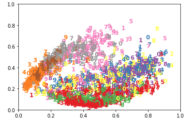
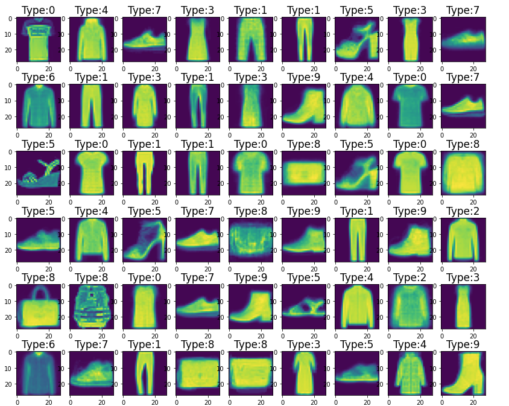

# Image classification (Task #3)

In most real-world applications, labelled data is scarce. Suppose you are given
the Fashion-MNIST dataset (https://github.com/zalandoresearch/fashion-mnist), but without any labels
in the training set. The labels are held in a database, which you may query to
reveal the label of any particular image it contains. Your task is to build a classifier to
>90% accuracy on the test set, using the smallest number of queries to this
>database. 

You may use any combination of techniques you find suitable
(supervised, self-supervised, unsupervised). However, using other datasets or
pre-trained models is not allowed.

Labels

Each training and test example is assigned to one of the following labels:

* 0 T-shirt/top
* 1 Trouser
* 2 Pullover
* 3 Dress
* 4 Coat
* 5 Sandal
* 6 Shirt
* 7 Sneaker
* 8 Bag
* 9 Ankle boot

### Sample of fashion dataset

### Scree plot of PCA

    

    * elbow method suggests 3 for principle components is a good start
    

### 2D plot of 10 different sample clusters

    

    * grouping is not well separated. Suggests that unsupervised clustering will likely not perform well.
     

### Output of clustering prediction

    

    * clustering accuracy seems to max out at 144-256 clusters.  Increasing number of clusters does not dramatically increase accuracy
     

### Confusion Matrix

 * catagories 2, 6, & 4 (pullover, shirt, and coat have the most crossover mismatches.  Seems to make sense from the eye test) 

### samples of the centroids of image types

    
    

    * Not reaching 90% accuracy desired for performance. only 75-80% in prediction.

## Attempted to implement SCAN 

https://paperswithcode.com/paper/learning-to-classify-images-without-labels    
https://github.com/wvangansbeke/Unsupervised-Classification

* implementation was difficult. Decided to try semi-supervised method

## Attempted to implement semi-supervised learning model:

### Diagram of semi-supervised modeling method with discriminator and generator

### Example 1 of generated image from generator

### Example 2 of generated image from generator

### Output of google colab notebook with GPU for 1 batch

### Output of google colab notebook with GPU with accuracy score for several batches

# Conclusion:

 Still not reaching 90% accuracy. More refinement of semi-supervised model and possibly implementing SCAN method may provide 90% accuracy desired.  I would like to play with this problem longer, but I'm running low on time. Very interesting, but the inability to use labels and the performance in unsupervised clustering makes it challenging  

